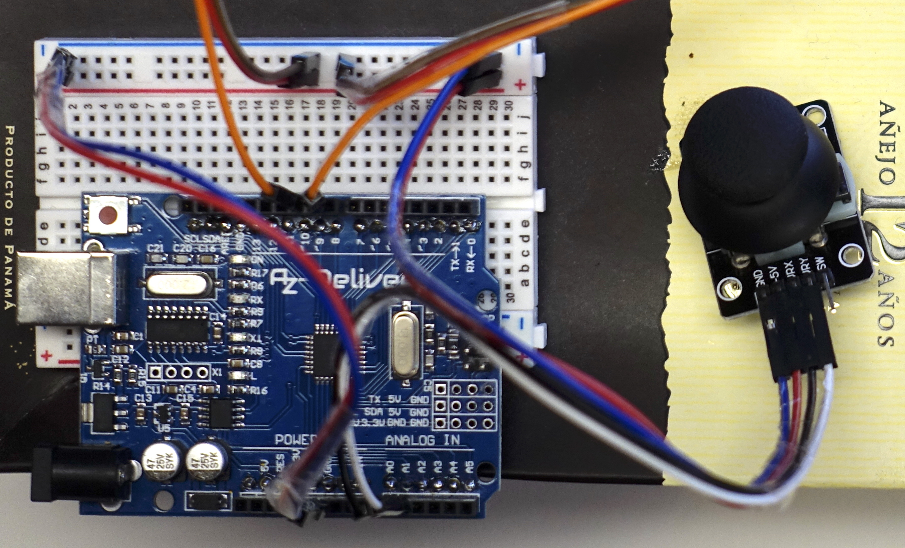
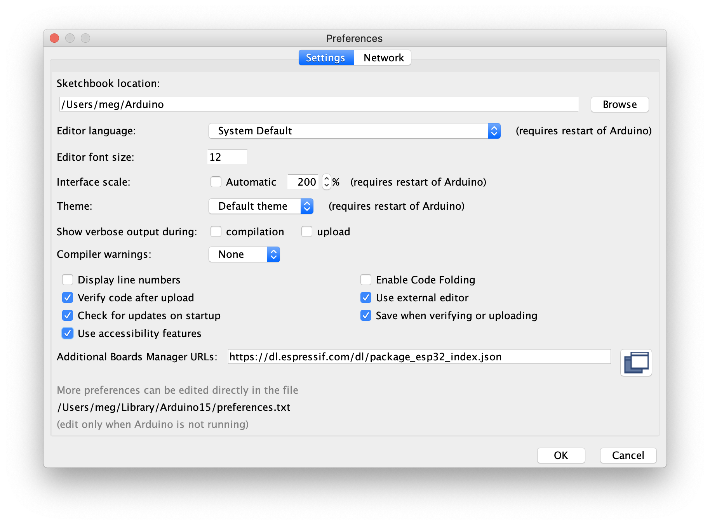

# Joystick Laser Test
## Summary

Use a joystick and tip-tilt mount. Create a laser pointer
controller.   


## Components

- Servo motor SG90 x 2
- Tip-Tilt mount
- Joystick, 2-axis, with a controller 
- Laser module, LASERFUCHS, class 1, 650nm, 0.4mW, 3-6 VDC
- Arduino Uno
- Jumper cables
- Breadboard
- micro USB -> TypeC converter cable (for my laptop)
- MacBook Pro
- Power unit (USB Battery)

## Library 
- ```Servo.h```

## Cabling
- Servo motor
  + brown (ground) -> '-' on breadboard 
  + red (+5V) '+' on breadboard 
  + yellow (control) -> 'A9' and 'A10' on Arduino

- Joystick
  + GND -> '-' on breadboard 
  + 5V -> '+' on breadboard 
  + VRX (x-axis) -> 'A0' on Arduino
  + VRY (y-axis) -> 'A1' on Arduino
  + SW (probably push switch of joystick) -> Not connected




## To do 
- Test laser pointer.
- Use push-button of the joystick to turn on the laser. 

------------------------------------------
## Trial 1.
### Goal
- Connect all components
- Upload the code to Arduino
- Run the code

### Visual Stduio Code
- Arduino IDE -> Preference -> 'Use external editor


### Import library
Tools -> Manage Library

### Check syntax
1. Use Arduino IDE. 
2. Select tick mark "v".

### Upload program
1. Use Arduino IDE. 
2. Select right arrow "->". 

### Select Device (to upload the code)
- Tools -> Ports -> (Select that looks likely)

------------------------------------------
## Trial 2.
### Goal
- Test laser by itself. 
  + how to turn on 
  + updatd code

------------------------------------------
### Code (copied from the reference below)
```
#include <Servo.h>
Servo tilt, pan;
int joyX = A0;
int joyX = A1;
int x, y;

void setup()
{
    tilt.attach(9);
    pan.attach(10);
}

void loop()
{

    x = joyX;
    y = joyY;
    x = map(analogRead(joyX), 0, 1023, 900, 2100);
    y = map(analogRead(joyY), 0, 1023, 900, 2100);
    tilt.write(x);
    pan.write(y);
    delay(15);
}
```
------------------------------------------

## Reference
1. "Arduino-Projekte" by Mark Geddes, dpunkt.verlag
